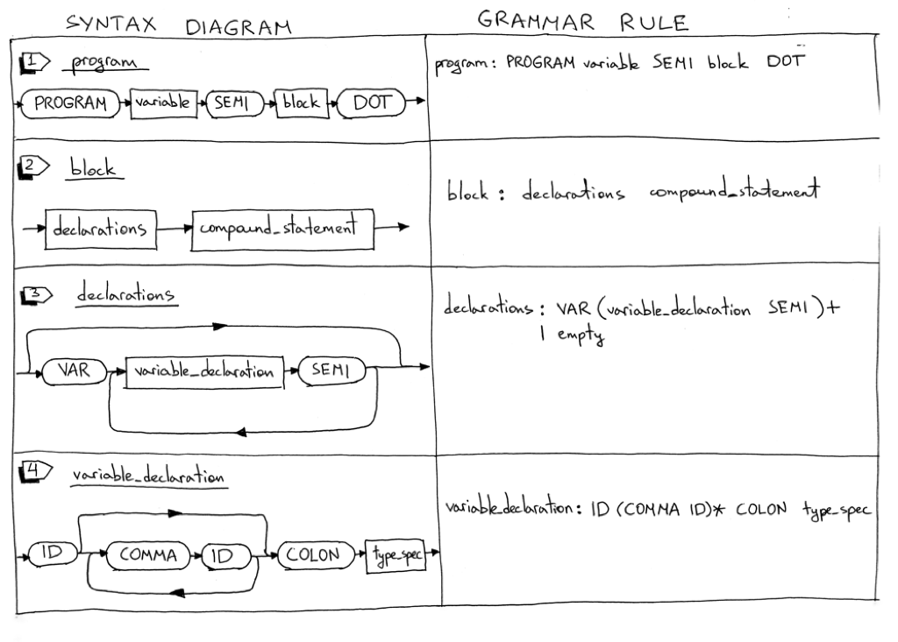
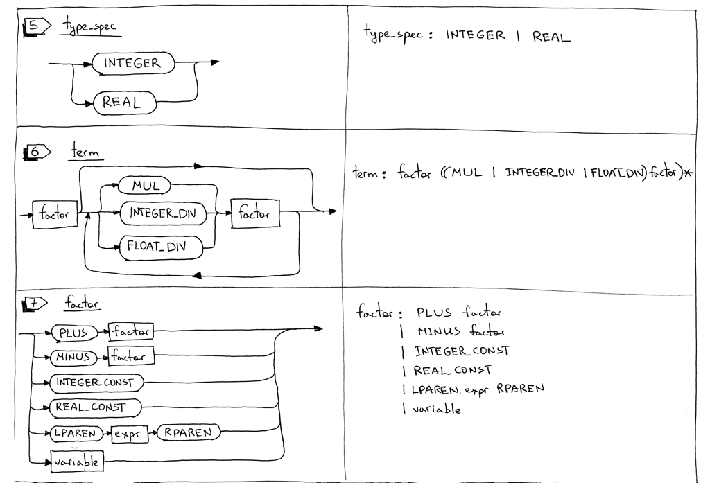

#今日解决问题
## 问题明细
1. We will learn how to parse and interpret the Pascal PROGRAM header
2. We will learn how to parse Pascal variable declarations
3. We will update our interpreter to use the DIV keyword for integer division and a forward slash / for float division
4. We will add support for Pascal comments
##
```
## 更新后的语法内容
## 需要注意到的点：DOT代表. ,SEMI代表;，COLON代表: 。
    program : PROGRAM variable SEMI block DOT

    block : declarations compound_statement

    declarations : VAR (variable_declaration SEMI)+
                 | empty

    variable_declaration : ID (COMMA ID)* COLON type_spec

    type_spec : INTEGER | REAL

    compound_statement : BEGIN statement_list END

    statement_list : statement
                   | statement SEMI statement_list

    statement : compound_statement
              | assignment_statement
              | empty

    assignment_statement : variable ASSIGN expr

    empty :

    expr : term ((PLUS | MINUS) term)*

    term : factor ((MUL | INTEGER_DIV | FLOAT_DIV) factor)*

    factor : PLUS factor
           | MINUS factor
           | INTEGER_CONST
           | REAL_CONST
           | LPAREN expr RPAREN
           | variable

    variable: ID
```


## 代码过程总体梳理
   1. 构建lexer,对输入的字符串进行lexical analysis,识别出对应的token。
   2. 构建parser，实现将输入的源码转换为IR(AST)
   3. 构建interceptor，对AST实现计算，实现整体逻辑
## 代码细节梳理
   1. 编码过程中，较为重要的部分就是AST的生成
   2. AST的生成是对整体编码语法的一个实现描述
   3. 目前代码的整体实现，遵循从顶之上原则，在各个规则指定完成后，从上到下完成各节点的关联管理，例如变量赋值，变量声明，变量计算。