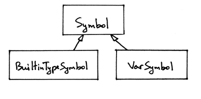

# day13的学习
## 一、本日学习总结
    主要是集中精力，解决程序编译过程中的变量类型检查问题。
## 二、为什么要进行类型变量检查
1. 程序语法编译通过，但是变量数据类型混乱
2. 确保所有的变量在运算前，都进行过变量类型的检查。
3. 确保所有的变量在使用前，都有过有效定义
## 三、变量类型的解决办法
### 前置条件
目前内置变量类型为integer,real，和对变量申明进行处理。
### 解决办法
目前仅对变量的类型，变量的名称进行了存储，变量的分类还没有进行明确存储。

```
    class Symbol(object):
    def __init__(self, name, type=None):
        self.name = name
        self.type = type
        self.category = category
    
    
    class BuiltinTypeSymbol(Symbol):
    def __init__(self, name):
        super().__init__(name)

    def __str__(self):
        return self.name

    def __repr__(self):
        return "<{class_name}(name='{name}')>".format(
            class_name=self.__class__.__name__,
            name=self.name,
        )
        
    
    
    class VarSymbol(Symbol):
    def __init__(self, name, type):
        super().__init__(name, type)

    def __str__(self):
        return "<{class_name}(name='{name}', type='{type}')>".format(
            class_name=self.__class__.__name__,
            name=self.name,
            type=self.type,
        )

    __repr__ = __str__
```
